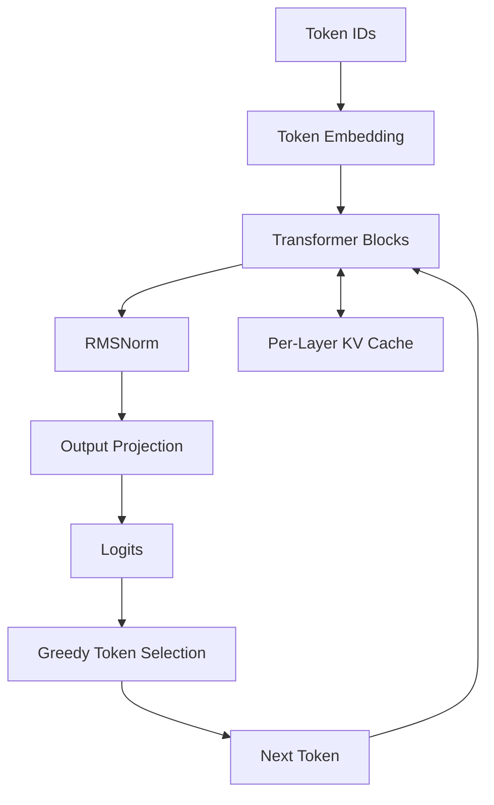

# Edge LLM Runtime

A lightweight CPU transformer inference runtime implemented from scratch in
modern C++.

The project explores the components behind edge-oriented large language model
inference, including tensor operations, transformer layers, autoregressive
generation, KV caching, weight-only INT8 quantization, benchmarking, and memory
management.

## Features

- Contiguous FP32 tensor storage with shape and bounds validation
- Matrix multiplication and element-wise tensor operations
- RMSNorm and numerically stable softmax
- Token embeddings and bias-free linear layers
- Rotary positional embeddings (RoPE)
- Causal multi-head self-attention
- SwiGLU feed-forward networks
- Pre-norm transformer blocks with residual connections
- Autoregressive greedy token generation
- Preallocated per-layer KV caches
- Separate prompt-prefill and single-token decode paths
- Per-output-row symmetric INT8 weight quantization
- Weight-only INT8 linear execution with FP32 activations
- Reusable output buffers for allocation-free INT8 kernel invocation
- FP32, INT8, cached-generation, and buffer-reuse benchmarks
- Numerical parity and error validation

## Architecture



Each transformer block uses the following pre-norm structure:

1. RMSNorm
2. Causal self-attention with RoPE
3. Residual connection
4. RMSNorm
5. SwiGLU feed-forward network
6. Residual connection

During prefill, the runtime processes the complete prompt and stores each
layer's rotated key tensors and value tensors. During decode, only the newly
generated token is projected while attention reuses the cached history.

## Requirements

- C++20-compatible compiler
- CMake 3.20 or newer

The project has been tested with Apple Clang 21 on ARM64 macOS. Linux builds
are supported through the CMake-based build system.

## Build

Configure and compile a Release build:

```bash
cmake -S . -B out/release \
  -DCMAKE_BUILD_TYPE=Release \
  -DEDGE_LLM_BUILD_TESTS=ON \
  -DEDGE_LLM_BUILD_BENCHMARKS=ON

cmake --build out/release
```

Run the command-line executable:

```bash
./out/release/edge_llm_cli
```

## Testing

Run the complete test suite:

```bash
ctest --test-dir out/release --output-on-failure
```

The test suite contains 14 executables covering tensors, mathematical
operations, neural-network primitives, transformer components, KV caching,
cached generation, and quantization.

## Benchmarking

Run the complete inference benchmark:

```bash
./out/release/edge_llm_benchmark
```

Save the results:

```bash
mkdir -p results

./out/release/edge_llm_benchmark |
  tee results/benchmark_results_macos_arm64.txt
```

Run the dedicated output-buffer benchmark:

```bash
./out/release/edge_llm_buffer_reuse_benchmark
```

Save its results:

```bash
./out/release/edge_llm_buffer_reuse_benchmark |
  tee results/buffer_reuse_results_macos_arm64.txt
```

The benchmarks use deterministic synthetic weights and fixed random seeds to
support repeatable comparisons.

## Reference Benchmark Results

The following results were collected on an Apple ARM64 system using Apple
Clang 21 and a Release build. These experiments use compact synthetic
configurations to demonstrate runtime behavior. They are not production LLM
performance measurements.

### FP32 versus weight-only INT8 linear execution

The linear benchmark used 32 input rows and a 256-by-256 weight matrix.

| Metric | FP32 | INT8 |
|---|---:|---:|
| Weight storage | 262,144 bytes | 66,560 bytes |
| Mean latency | 2.4085 ms | 1.9846 ms |
| Median latency | 2.3347 ms | 1.9740 ms |
| P95 latency | 2.9938 ms | 2.0264 ms |
| Throughput | 13,286 rows/sec | 16,124 rows/sec |

Per-row INT8 quantization reduced weight storage by approximately 74.6%,
providing 3.94x compression. For this benchmark configuration, INT8 execution
was 1.21x faster than FP32.

The maximum absolute output error was 0.0217, and the mean absolute error was
0.0042.

### Uncached versus KV-cached generation

The generation benchmark used:

- Vocabulary size: 128
- Model dimension: 32
- Hidden dimension: 64
- Attention heads: 4
- Transformer blocks: 2
- Prompt length: 16 tokens
- Generated length: 8 tokens

| Metric | Uncached | KV cached |
|---|---:|---:|
| Mean generation latency | 3.6798 ms | 0.5762 ms |
| Generated tokens/sec | 2,174 | 13,883 |
| Relative speedup | 1.00x | 6.39x |

KV caching reduced mean generation latency by approximately 84.3% for this
configuration. Cached and uncached execution produced identical generated token
sequences.

Isolated cached decode latency averaged 0.0260 ms per token. The preallocated
KV-cache payload occupied 11,776 bytes.

The complete output is available in
`results/benchmark_results_macos_arm64.txt`.

### Reusable output buffers

`QuantizedLinear::forward_into()` accepts a preallocated output tensor. This
allows decode-oriented callers to reuse existing storage instead of constructing
a new output tensor for every invocation.

The buffer benchmark used a single-token 256-input, 256-output INT8 linear
workload.

| Execution path | Mean latency | Median latency | P95 latency |
|---|---:|---:|---:|
| Allocating output | 0.061504 ms | 0.056917 ms | 0.082208 ms |
| Reusing output | 0.061391 ms | 0.056833 ms | 0.082042 ms |

The reusable path eliminated one 1,024-byte output allocation per invocation
while producing identical numerical output.

The measured mean-latency difference was approximately 0.18%, which is not
considered a meaningful performance improvement. This result indicates that
scalar INT8 computation, rather than output allocation, dominates this
particular kernel.

The complete output is available in
`results/buffer_reuse_results_macos_arm64.txt`.

## Quantization Design

The runtime implements symmetric weight-only INT8 quantization independently
for each output row.

For every row, the quantization scale is calculated as:

```text
scale = maximum_absolute_weight / 127
```

Each FP32 weight is then converted with:

```text
quantized_weight = round(float_weight / scale)
```

During execution, weights are dequantized inside the linear kernel:

```text
float_weight = quantized_weight * scale
```

Activations and accumulation remain FP32. This implementation prioritizes
portability and clarity over platform-specific SIMD optimization.

## Project Structure

```text
edge-llm-runtime-cpp/
├── apps/
│   └── main.cpp
├── benchmarks/
│   ├── benchmark.cpp
│   └── buffer_reuse_benchmark.cpp
├── include/
│   └── edge_llm/
├── results/
├── src/
├── tests/
├── CMakeLists.txt
├── LICENSE
└── README.md
```

## Scope and Limitations

This project is an educational CPU inference runtime rather than a replacement
for production systems such as llama.cpp, ONNX Runtime, or hardware-specific
accelerator runtimes.

The current implementation:

- Uses synthetic weights rather than loading pretrained checkpoints
- Uses greedy decoding rather than probabilistic sampling
- Uses portable scalar kernels without SIMD or BLAS acceleration
- Implements weight-only INT8 quantization rather than fully integer inference
- Supports single-sequence CPU inference rather than continuous batching
- Does not currently include a tokenizer or model-file format

## Next Milestone

The final engineering milestone will add:

- Automated Linux and macOS builds through GitHub Actions
- Linux `perf stat` and `perf record` profiling instructions
- Sanitizer-enabled development builds
- Final repository and documentation cleanup

## License

This project is licensed under the MIT License.
